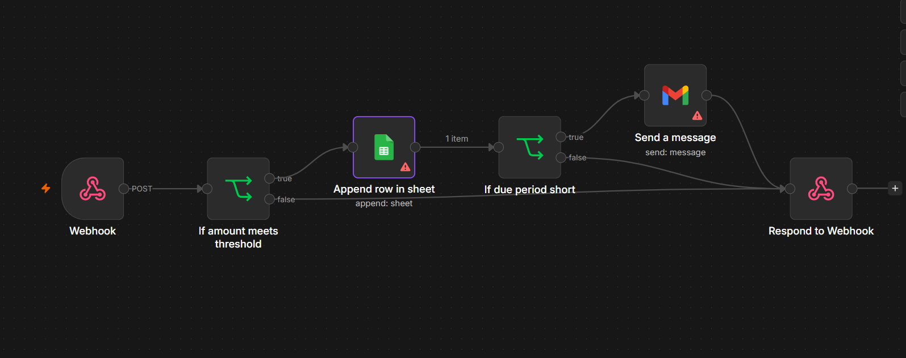

# 📑 AI Invoice Document Orchestrator

## Overview
The **AI Invoice Document Orchestrator** is an intelligent document processing application built with Streamlit, Google Gemini AI, and n8n. It allows users to upload invoices (PDF, PNG, JPG), automatically extracts key information using a structured JSON schema via Gemini AI, and triggers an n8n automation workflow for handling approvals, data logging, and email notifications based on customizable thresholds.

## Features
- **Intelligent Extraction:** Uses Google Gemini AI to accurately extract vendor names, total amounts, dates, and line items from invoices.
- **Structured Output:** Enforces a Pydantic schema to ensure reliable, predictable JSON data extraction.
- **Interactive UI:** A clean Streamlit interface with sliders to dynamically configure business rules (Minimum Amount and Maximum Due Days).
- **Automated Workflow:** Seamlessly sends extracted data to an n8n Webhook for backend processing.
- **Conditional Logic (n8n):** 
  - Checks if the invoice amount exceeds the specified threshold.
  - Appends valid records to Google Sheets.
  - Triggers automated email alerts if the payment due period is critically short.

## Architecture
1. **Frontend:** Streamlit web application.
2. **AI Engine:** Google Gemini (configured for `gemini-2.0-flash-lite` or similar).
3. **Automation/Backend:** n8n Workflow.

### n8n Workflow Architecture



---

## Setup & Installation

### Prerequisites
- Python 3.8+
- Google Gemini API Key
- n8n instance (Local or Cloud) with an active Webhook URL
- Google Workspace/Gmail account for n8n integrations (Sheets & Mail)

### 1. Clone the repository
```bash
git clone <repository-url>
cd invoice-orchestrator
```

### 2. Install dependencies
```bash
pip install streamlit pydantic google-generativeai requests
```

### 3. Configure Secrets
Create a `.streamlit/secrets.toml` file in the root directory of your project and add your credentials:
```toml
GEMINI_API_KEY = "your-gemini-api-key"
N8N_PROD_URL = "your-n8n-webhook-url"
```

### 4. Run the Application
```bash
streamlit run app.py
```
